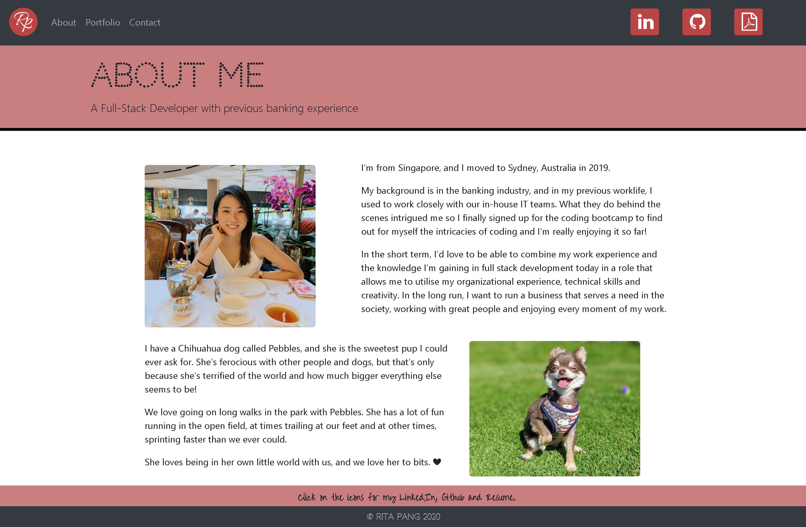
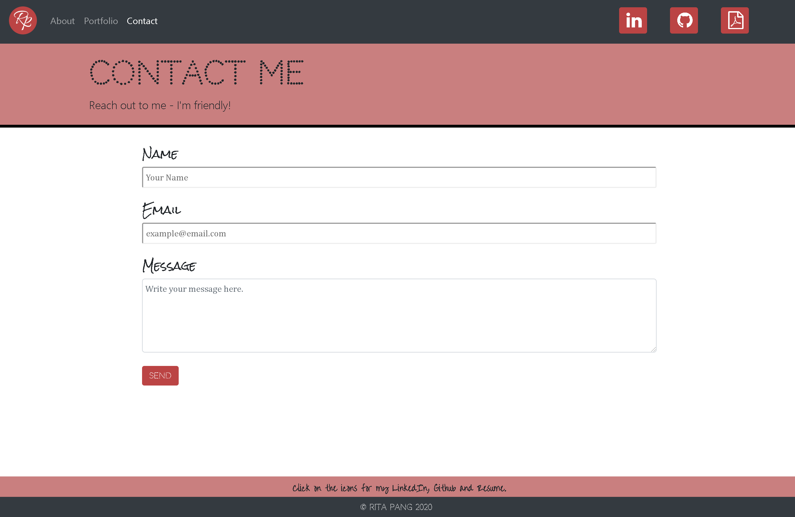

https://sevenspell.github.io/

This project was bootstrapped with React.js, and has a responsive mobile-first design.

## Applications Used
+ Compression
+ React
+ TinyJPG for image compression

A personal page containing:
1) Personal Introduction Page

This was created using React and Bootstrap, designed to have a clean and easy-on-the-eyes look to it. This page contains a simple introduction to myself. As mentioned under the "Navbar" section below, the icons to my LinkedIn account, Github page and my resume are easily available on the top right.

2) Portfolio Page
This was designed using Bootstrap Cards, with responsive image sizing based on screen size. It contains links to 10 projects I've completed so far, as part of the coursework for this Bootcamp. Scroll down to see the rest of the projects.

3) Contact Me form
This was designed using Bootstrap forms and using Formspree as server base.

Navbar:
It includes a responsive navbar with my own logo, and 3 links to the abovementioned pages. It also contains icons to my Linkedin account, Github page, and a read-only copy of my resume.

Header and Footer:
It includes a header and a sticky footer component.

General Color Scheme:
The color scheme is white, dark grey and my favourite shade of red.

## Credits
I got a deeper understanding of React concepts from Wagner (https://wagner-lopes.github.io/).

